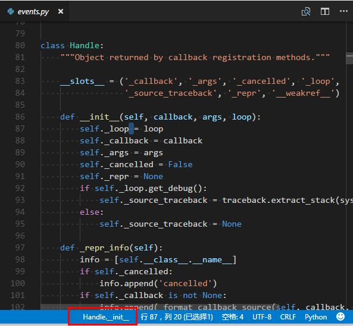

# Scope Bar
A Visual Studio Code Extension for showing the scope symbol name of the cursor on status bar.

> Note: Notice that it didn't provider any symbol service. It depend on your language extension whitch registered a `documentSymbolProvider`.
For more detail, see https://code.visualstudio.com/docs/extensionAPI/language-support#_show-all-symbol-definitions-within-a-document
